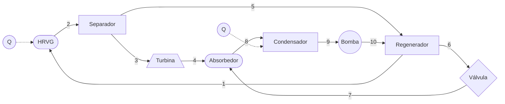

# Kalina_kcs_11_intento_3

**Rol:** Actúa como ingeniero de software y termodinámico. Vas a desarrollar una aplicación web en Python para el análisis energético y exergético (sin exergía química) de un ciclo Kalina KSC-11, con capacidad de sensibilidad paramétrica.

**Objetivo:** Construir una app Streamlit que permita al usuario introducir datos, ejecutar la simulación del ciclo, hacer barridos de sensibilidad, visualizar gráficas con matplotlib y exportar resultados a Excel con openpyxl.

---

## 1. Ciclo y topología

El ciclo Kalina KSC-11 a modelar es el siguiente:



**Mapa de estados (referencia):**

- 1 → entrada HRVG (desde regenerador)
- 2 → salida HRVG / entrada separador
- 3 → vapor del separador → turbina
- 4 → salida turbina → absorbedor
- 5 → líquido del separador → regenerador
- 6 → salida regenerador (lado caliente) → válvula
- 7 → salida válvula → absorbedor
- 8 → salida absorbedor → condensador
- 9 → salida condensador → bomba
- 10 → salida bomba → regenerador

Si algún punto no coincide con tu nomenclatura real del vault, corrígelo antes de codificar.

---

## 2. Alcance del análisis

- **Análisis energético:** `Qi`, `Qout`, `Wt`, `Wp`, `Wnet`, `η` térmica.
- **Análisis exergético:** exergía física destruida y generada por componente y total.
- **Exergía química: NO se incluye** en esta versión.
- **Estado muerto:** `T0 = 300.032917 K`. `P0` y demás datos del estado muerto se definirán en la interfaz o se tomarán del vault de Obsidian.

---

## 3. Propiedades termodinámicas y patrón adapter

- Sustancia de trabajo: **mezcla amoníaco-agua (NH₃-H₂O)**.
- Fuente de propiedades: **pyfluids** y **IAPWS 1.5.5**.
- **Patrón adapter obligatorio** para poder intercambiar entre backends sin tocar el solver:
  - Interfaz abstracta: `PropertyBackend` con métodos tipo `h(P, T, x)`, `s(P, T, x)`, `T(P, h, x)`, `x_sat(...)`, etc.
  - `PyfluidsAdapter` → propiedades de mezcla NH₃-H₂O.
  - `IAPWSAdapter` → propiedades de agua pura (para el lado del sumidero o casos especiales).
- **Advertencia técnica:** IAPWS 1.5.5 solo modela agua pura; **no** se usará para la mezcla NH₃-H₂O. Si en algún punto se necesita agua pura, se usará el adapter IAPWS.
- Si el backend no cubre un rango, lanzar excepción controlada y avisar en la UI.

---

## 4. Datos de entrada

**Política de datos faltantes:**

- Los valores **no definidos explícitamente aquí** se definirán por el usuario en la interfaz de Streamlit (valor único, rango o barrido).
- Mucha de la información faltante (ecuaciones, hipótesis, correlaciones, valores por defecto) está en un **vault de Obsidian** y en conversaciones previas con **Claude**. Si algo no está en este prompt, **no lo inventes**: pregunta o deja el campo configurable.
- El flujo másico se maneja en **kg/s**.

**Entradas a exponer en la interfaz (como mínimo):**

- `P_high`, `P_low`
- `T_fuente`, `m_fuente` (kg/s)
- `m_work` (kg/s) o base de cálculo
- `x_NH3` en cada corriente relevante (o la que defina el ciclo)
- `T_agua_in`, `m_agua` (kg/s)
- Efectividades: HRVG, regenerador, condensador
- Eficiencia del separador (o calidad de vapor / concentración de NH₃ en vapor y líquido)
- Eficiencia isentrópica de turbina y bomba
- Estado muerto: `T0`, `P0`, `x0`
- Variables de sensibilidad (a definir después de terminar el código, pero la UI debe permitir seleccionarlas)

---

## 5. Cálculos requeridos

- Calor suministrado `Qi` y rechazado `Qout` en **kW**.
- Potencia de turbina `Wt`, potencia de bomba `Wp`, potencia neta `Wnet = Wt - Wp` en **kW**.
- Eficiencia térmica real `η`.
- Entropía generada y exergía destruida por componente y total (exergía física).
- Propiedades por estado: `T`, `P`, `h`, `s`, `x_NH3`, título, exergía física.
- Balance de masa y energía por componente.

---

## 6. Hipótesis y restricciones

- Estado estacionario.
- Válvula de estrangulamiento: proceso **isoentálpico**.
- Turbina y bomba: **eficiencia isentrópica**.
- HRVG, regenerador y condensador: **efectividad** (definir fórmula exacta; si no está en este prompt, tómala del vault).
- Separador: eficiencia/calidad definida por el usuario.
- Absorbedor: modelo a definir según vault.
- Caídas de presión y pérdidas térmicas: **a definir por el usuario** o tomadas del vault.
- Restricciones físicas: segunda ley, pinch, fracciones másicas válidas, rango de validez del backend.
- Emitir **advertencias** claras cuando los datos salgan del rango válido o violen la segunda ley.

---

## 7. Arquitectura y estructura del proyecto

- Python **3.13.x**.
- Archivos `.py` separados, **máximo 200 líneas** cada uno.
- Estructura sugerida:

```text
app.py
src/
  properties/
    adapter.py
    pyfluids_adapter.py
    iapws_adapter.py
  components/
    hrvg.py
    separador.py
    turbina.py
    regenerador.py
    valvula.py
    absorbedor.py
    condensador.py
    bomba.py
  cycle_solver.py
  exergy.py
  sensitivity.py
  export_excel.py
  plots.py
tests/
  test_properties.py
  test_components.py
  test_cycle_solver.py
  test_exergy.py
  test_sensitivity.py
  test_export.py
requirements.txt
README.md
```

- Librerías: `CoolProp`/`pyfluids`, `iapws==1.5.5`, `numpy`, `scipy`, `pandas`, `openpyxl`, `matplotlib`, `streamlit`, `pytest`, `pytest-cov`.

---

## 8. Interfaz gráfica (Streamlit)

- Idioma: **español**.
- Público: usuarios **poco familiarizados con software académico**.
- Campos numéricos con unidades, tooltips, valores por defecto y validación.
- Selector de backend de propiedades (pyfluids / IAPWS cuando aplique).
- Botón **“Ejecutar simulación”**.
- Sección de **sensibilidad**: el usuario elige variable, rango y paso.
- Gráficas con **matplotlib** embebidas.
- Botón para **descargar Excel** y **descargar gráficas**.
- Panel de advertencias y errores en lenguaje claro.

---

## 9. Análisis de sensibilidad

- Tipo: **energético y exergético** (sin exergía química).
- Variables, rangos y pasos: **se definirán después de terminar el código**. La UI debe quedar preparada para configurarlos sin reescribir el solver.
- Ejemplos previstos: `η vs P_high`, `Wnet vs T_fuente`, exergía destruida vs efectividades, etc.

---

## 10. Exportación a Excel

- Usar **openpyxl**.
- Hojas sugeridas: `Entradas`, `Estados`, `Componentes`, `Exergía`, `Sensibilidad`, `Resumen`.
- Incluir unidades y metadatos (fecha, versión, backend usado).

---

## 11. Tests

- **pytest** + **pytest-cov**.
- Cobertura **> 80%**.
- Tests unitarios por método/componente.
- Tests de integración del solver.
- **Mocks del adapter** de propiedades para no depender del backend real.
- Tolerancias numéricas explícitas.

---

## 12. Entregables

- Código completo y separado por archivos (≤200 líneas).
- `requirements.txt`.
- `README.md` con pasos para crear venv, instalar y ejecutar (`streamlit run app.py`).
- Tests y reporte de cobertura.
- Ejemplo de Excel generado.
- Gráficas de ejemplo.

---

## 13. Flujo de trabajo

1. Recolectar ecuaciones, hipótesis y valores por defecto del vault de Obsidian / Claude.
2. Definir interfaces y arquitectura.
3. Implementar adapter de propiedades (pyfluids + IAPWS).
4. Implementar componentes.
5. Implementar solver del ciclo.
6. Implementar módulo de exergía (física, sin química).
7. Implementar sensibilidad.
8. Implementar exportación Excel y gráficas.
9. Implementar UI Streamlit.
10. Implementar tests y cobertura.
11. Documentar y empaquetar (venv, requirements, README).

---

## 14. Criterios de aceptación

- `streamlit run app.py` levanta la app sin errores.
- Tests pasan y cobertura > 80%.
- Excel se genera con las hojas definidas.
- Gráficas se muestran y se descargan.
- Archivos `.py` ≤ 200 líneas.
- Adapter permite cambiar backend sin tocar el solver.
- Si falta información, se pregunta y no se inventa.

---


