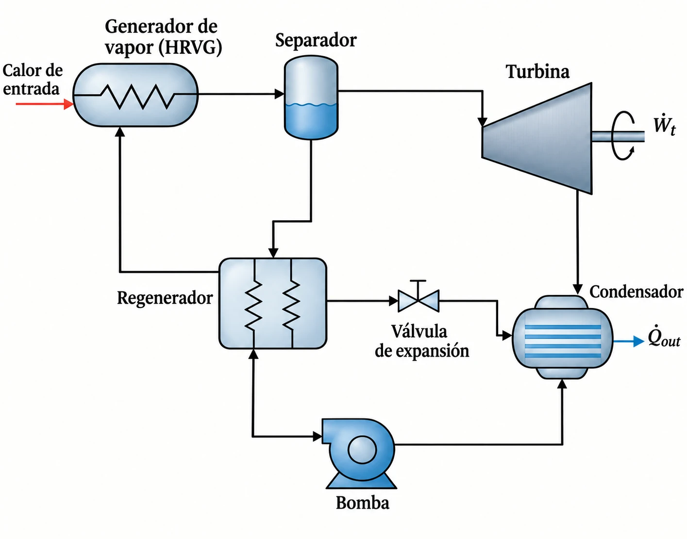

# NOMENCLATURA

## Variables

| Símbolo | Descripción | Unidad |
|---|---|---|
| $C$ | Número de componentes químicos independientes | — |
| $\dot{E}_d$ | Exergía destruida | kW |
| $ex$ | Exergía física específica | kJ/kg |
| $F$ | Grados de libertad | — |
| $h$ | Entalpía específica | kJ/kg |
| $\dot{m}$ | Flujo másico | kg/s |
| $M$ | Masa molar | g/mol |
| $P$ | Presión | kPa |
| $\mathcal{P}$ | Número de fases en equilibrio | — |
| $q$ | Título o calidad de vapor | — |
| $\dot{Q}$ | Flujo de calor | kW |
| $s$ | Entropía específica | kJ/(kg·K) |
| $\dot{S}_{gen}$ | Entropía generada | kW/K |
| $T$ | Temperatura absoluta | K |
| $\dot{W}$ | Potencia | kW |
| $x$ | Fracción másica de amoníaco | kg NH₃ / kg mezcla |

## Letras griegas

| Símbolo | Descripción | Unidad |
|---|---|---|
| $\varepsilon$ | Efectividad de intercambiador | — |
| $\eta$ | Eficiencia térmica del ciclo | — |
| $\eta_p$ | Eficiencia isentrópica de la bomba | — |
| $\eta_t$ | Eficiencia isentrópica de la turbina | — |
| $\Phi$ | Energía libre de Helmholtz reducida | — |

## Subíndices

| Símbolo | Descripción |
|---|---|
| 0 | Estado muerto (referencia exergética) |
| 1…10 | Estados del ciclo |
| b | Solución básica |
| burbuja | Punto de burbuja |
| cond | Condensador |
| d | Destruida (exergía) |
| f | Fuente térmica |
| gen | Generada (entropía) |
| glide | Deslizamiento de temperatura |
| in | Suministrado |
| max, min | Valor límite termodinámico |
| net | Neto |
| out | Rechazado |
| p | Bomba |
| reg | Regenerador |
| rocío | Punto de rocío |
| s | Sumidero térmico |
| t | Turbina |

## Superíndices y notación auxiliar

| Símbolo | Descripción |
|---|---|
| $\circ$ | Contribución de gas ideal |
| $r$ | Contribución residual |
| $s$ (como en $h_{4s}$) | Estado isentrópico de referencia |

## Siglas

| Sigla | Significado |
|---|---|
| DCSS | *Distillation and Condensation Sub-System* |
| HRVG | *Heat Recovery Vapor Generator* |
| IAPWS | *International Association for the Properties of Water and Steam* |
| KCS | *Kalina Cycle System* |
| KCS11 | *Kalina Cycle System 11* |
| NIST | *National Institute of Standards and Technology* |
| VLE | Equilibrio líquido-vapor |

\newpage

# 1. INTRODUCCIÓN

La disponibilidad de energía constituye uno de los factores determinantes del desarrollo económico y social contemporáneo. La industria, el transporte, la climatización de espacios y la generación eléctrica dependen de un suministro continuo de energía en formas útiles, y buena parte de ese suministro proviene todavía de la conversión de energía térmica en trabajo mecánico: los combustibles fósiles, la biomasa y el calor residual de procesos industriales constituyen fuentes térmicas cuyo aprovechamiento eficiente resulta cada vez más determinante, tanto por razones económicas como por la creciente exigencia de reducir el impacto ambiental asociado a su uso (Cengel y Boles, 2012). En este contexto, la ingeniería mecánica enfrenta el reto no solo de generar energía, sino de hacerlo con la mayor eficiencia posible a partir de los recursos disponibles.

Esa exigencia ha impulsado, por un lado, la diversificación de las fuentes primarias de energía. Recursos como la radiación solar, el viento, la geotermia o la biomasa se han incorporado progresivamente a la matriz energética como alternativas o complementos a los combustibles convencionales, cada uno con su propia tecnología de conversión —paneles fotovoltaicos y colectores térmicos para la energía solar, aerogeneradores para la eólica, entre otros—. Estas fuentes, sin embargo, no agotan el potencial energético disponible: junto a ellas existe un volumen considerable de energía térmica de baja temperatura que hoy se desaprovecha o se aprovecha solo parcialmente, proveniente tanto de recursos geotérmicos de baja entalpía como del calor residual que descartan al ambiente los procesos industriales, los motores de combustión y las turbinas de gas.

Este tipo de fuentes térmicas —calor de desecho o de baja temperatura— ha recibido, en comparación con los combustibles convencionales y con las energías renovables de mayor escala, una atención tecnológica más reciente y todavía limitada. La razón es fundamentalmente termodinámica: los ciclos de potencia convencionales, como el ciclo Rankine con un fluido puro, pierden eficiencia de forma marcada al operar entre una fuente y un sumidero de temperatura moderada, porque un fluido puro evapora y condensa a temperatura constante mientras que las corrientes externas de las que se extrae o a las que se rechaza el calor varían la suya de forma continua, lo que genera diferencias de temperatura amplias —y, con ellas, una irreversibilidad considerable— en al menos una parte del intercambio térmico (Moran y Shapiro, 2004). Aprovechar eficientemente estas fuentes exige, en consecuencia, una configuración de ciclo capaz de adaptar su propio perfil térmico al de la fuente y al del sumidero disponibles.

Frente a esta necesidad surge el ciclo Kalina, propuesto por Kalina (1984), un ciclo de potencia que resuelve el problema anterior mediante un cambio en el fluido de trabajo: en lugar de una sustancia pura, emplea una mezcla binaria de amoníaco y agua. A diferencia de un fluido puro, esta mezcla cambia de fase con variación de temperatura —fenómeno conocido como deslizamiento de temperatura o *glide*— y admite además variaciones de composición entre los distintos estados del ciclo. Ambas propiedades permiten ajustar el perfil térmico del fluido de trabajo al de las corrientes externas a lo largo de todo el intercambio de calor, reduciendo la diferencia de temperatura promedio y, con ella, la irreversibilidad asociada a la transferencia de calor (Kalina, 1984).

Los beneficios de esta solución se traducen en un desempeño termodinámico superior al de los ciclos convencionales precisamente en el rango de temperaturas donde estos últimos son menos eficientes: estudios comparativos han reportado que ciclos de potencia con mezcla amoníaco-agua, como el Kalina, producen más potencia que un ciclo Rankine de vapor convencional operando como ciclo de cola sobre fuentes de calor de temperatura moderada, como los gases de escape de motores de combustión (Ibrahim y Klein, 1996; Jonsson y Yan, 2001). A esto se suma una ventaja adicional inexistente en los fluidos puros: la composición de la mezcla constituye un parámetro de ajuste propio del ciclo, que permite modificar su desempeño y su acoplamiento térmico sin alterar la configuración física de los equipos.

Estos beneficios no son solo teóricos. El ciclo Kalina cuenta con aplicaciones reales documentadas, principalmente en el aprovechamiento de recursos geotérmicos de baja y media entalpía —la planta de Húsavík, en Islandia, es el caso de referencia más citado en la literatura (Mlcak et al., 2002)— y, más recientemente, en la recuperación de calor residual de procesos industriales de alta demanda térmica. La industria cementera constituye un ejemplo particularmente pertinente: los gases del precalentador del horno y el circuito de enfriamiento de clínker liberan corrientes de gas a varios cientos de grados Celsius y con caudales del orden de decenas de kilogramos por segundo, que hoy se rechazan en buena medida sin aprovechamiento, y para las cuales ya se han propuesto y evaluado plantas Kalina de recuperación (Mirolli, 2005). Estas aplicaciones confirman que el ciclo Kalina no es una alternativa exclusivamente académica, sino una tecnología con antecedentes de implementación efectiva en el aprovechamiento de fuentes de calor que, de otro modo, se rechazarían sin utilidad.

El presente trabajo desarrolla el modelo termodinámico de un ciclo Kalina en su configuración KCS-11, alimentado por una corriente de gases de escape y enfriado mediante agua, y evalúa su comportamiento mediante dos análisis complementarios. El **análisis energético** determina el calor suministrado $\dot Q_{in}$, el calor rechazado $\dot Q_{out}$, la potencia neta $\dot W_{net}$ y la eficiencia térmica $\eta$ del ciclo. El **análisis exergético**, restringido a la exergía física —se excluye explícitamente la exergía química, justificado en la sección 8—, identifica la entropía generada y la exergía destruida en cada componente, lo que permite distinguir cuáles de ellos concentran las mayores irreversibilidades del sistema: a diferencia de un análisis puramente energético, que trataría por igual una pérdida de calor al ambiente y una irreversibilidad interna del mismo tamaño en kW, el balance exergético revela cuál de las dos representa una pérdida real de capacidad de producir trabajo (Moran y Shapiro, 2004).

El modelo se implementa en Python, empleando como motor de propiedades una implementación de la formulación de referencia de Tillner-Roth y Friend (1998) —adoptada por la *International Association for the Properties of Water and Steam* como guía IAPWS G4-01 (IAPWS, 2001)—, verificada de forma cruzada contra una segunda implementación independiente de la misma ecuación de estado (sección 3.5). La herramienta computacional cumple, no obstante, un papel instrumental: el centro del análisis permanece en el comportamiento termodinámico del sistema, y la arquitectura del código que lo resuelve no es objeto de este documento. Disponer de un modelo computacional no garantiza, además, una representación fiel del ciclo si no incorpora las condiciones no ideales de su operación: por ello el modelo contempla eficiencias isentrópicas para la turbina y la bomba, y efectividades para los tres intercambiadores de calor —el generador de vapor de recuperación de calor, el regenerador interno y el condensador—, alejando deliberadamente el análisis del modelo ideal.

La estructura del documento responde a esa finalidad. La sección 3 expone el fundamento termodinámico de la mezcla amoníaco-agua y de la exergía física, necesario para interpretar correctamente los estados del ciclo y los resultados del balance de irreversibilidades. La sección 4 describe la configuración analizada y sus componentes. La sección 5 declara las hipótesis bajo las cuales opera el modelo. La sección 6 desarrolla la formulación matemática completa, energética y exergética, que describe cada proceso y sobre la cual se construye el modelo implementado. Las secciones 7 y 8 cierran el documento declarando, respectivamente, los criterios de verificación que el modelo aplica sobre sus propios resultados y el alcance y las limitaciones bajo los cuales se plantea el análisis.

\newpage

# 2. OBJETIVOS

## 2.1 Objetivo general

Modelar termodinámicamente un ciclo Kalina KCS-11, alimentado por una corriente de gases de escape y enfriado mediante agua, para evaluar su desempeño energético y exergético bajo condiciones reales de operación.

## 2.2 Objetivos específicos

- Formular los balances de masa, especie y energía de cada componente del ciclo, incorporando eficiencias isentrópicas en turbina y bomba, y efectividades en los intercambiadores de calor.
- Formular el balance de exergía física del ciclo, determinando la entropía generada y la exergía destruida por componente a partir de un estado muerto de referencia.
- Establecer los criterios de verificación —restricciones de segunda ley e identidades de cierre— que permiten comprobar la consistencia interna del modelo antes de emplearlo para evaluar el desempeño del ciclo.
- Declarar explícitamente el alcance y las simplificaciones bajo las cuales se plantea el modelo, distinguiendo lo que el análisis cubre de lo que queda fuera de su propósito.

\newpage

# 3. MARCO TEÓRICO

## 3.1 Comportamiento zeotrópico de mezclas binarias

Una mezcla zeotrópica, también llamada no azeotrópica, es aquella cuyos componentes tienen puntos de ebullición distintos, de modo que sus fases líquida y vapor en equilibrio presentan composiciones diferentes entre sí y distintas de la composición global de la mezcla. Su condición opuesta es la mezcla azeotrópica, que a presión constante cambia de fase a temperatura constante y se comporta, dentro de un circuito termodinámico, de manera equivalente a un fluido puro.

El principio físico que gobierna una mezcla zeotrópica es sencillo de enunciar: al combinar dos sustancias con volatilidades distintas, la fase vapor que se forma durante una evaporación parcial se enriquece en el componente más volátil, mientras que la fase líquida residual se empobrece en él (Elsayed et al., 2013). Por ser el amoníaco el componente de menor punto de ebullición del par NH₃-H₂O, el vapor generado en una evaporación parcial de la mezcla resulta siempre más rico en amoníaco que el líquido del cual proviene. Este comportamiento zeotrópico, sistemáticamente reportado en la literatura sobre ciclos de potencia y sistemas de absorción para el sistema amoníaco-agua (Tillner-Roth y Friend, 1998), constituye el fundamento físico que el ciclo Kalina aprovecha en su separador: al no coexistir las dos fases con la misma composición, es posible extraer de una única corriente bifásica dos corrientes de propiedades distintas, una rica en amoníaco destinada a producir trabajo y otra pobre en amoníaco destinada a la recuperación interna de calor.

## 3.2 Deslizamiento de temperatura (*glide*)

El deslizamiento de temperatura se define como la diferencia entre las temperaturas de rocío y de burbuja de la mezcla, evaluadas a presión y composición global constantes:

$$\Delta T_{glide} = T_{rocío}(P,\,x) - T_{burbuja}(P,\,x) \qquad (1)$$

Para una sustancia pura, la temperatura de rocío coincide con la de burbuja a cualquier presión dada, de modo que el cambio de fase ocurre a temperatura constante. Para una mezcla zeotrópica, en cambio, ambas temperaturas se separan, y el cambio de fase transcurre a lo largo de un intervalo continuo de temperatura mientras la composición de cada fase varía progresivamente desde el líquido saturado hasta el vapor saturado.

La consecuencia de este fenómeno sobre el desempeño de un intercambiador de calor es directa. Cuando el fluido de trabajo es una sustancia pura, su temperatura permanece constante durante el cambio de fase mientras la corriente externa (gases de escape o agua de enfriamiento) varía la suya de forma continua; la diferencia de temperatura entre ambas corrientes resulta entonces necesariamente amplia en alguna región del intercambiador, y esa diferencia finita de temperatura constituye, por sí misma, una fuente de generación de entropía. Al emplear una mezcla zeotrópica, el fluido de trabajo también varía su temperatura durante el cambio de fase, lo que permite que su perfil térmico se aproxime al de la corriente externa a lo largo de todo el intercambiador, reduciendo la diferencia de temperatura promedio y, con ella, la irreversibilidad asociada a la transferencia de calor (Kalina, 1984; Ibrahim y Klein, 1996). Esta es la razón termodinámica que sustenta el empleo de la mezcla amoníaco-agua en el ciclo Kalina, y el motivo por el cual el análisis exergético de la sección 6.3 resulta especialmente informativo en este ciclo: permite cuantificar, componente por componente, cuánto de esa reducción teórica de irreversibilidad se materializa realmente bajo las condiciones de operación declaradas.

El deslizamiento no es, sin embargo, una propiedad libre de elegir: para una composición global $x$ dada, $\Delta T_{glide}$ queda fijado por la propia termodinámica de la mezcla a cada presión, y solo puede modificarse cambiando esa composición. Esta dependencia es la que conecta el fenómeno con la regla de fases desarrollada en la sección 3.3: el deslizamiento es, en el fondo, la manifestación observable de que, en la región bifásica de una mezcla binaria, temperatura y composición de cada fase están acopladas por los dos grados de libertad disponibles, y no son ajustables de forma independiente.

## 3.3 Regla de fases de Gibbs

El número de propiedades intensivas independientes que deben especificarse para fijar por completo el estado intensivo de un sistema en equilibrio se obtiene de la regla de fases de Gibbs, un resultado general de la termodinámica del equilibrio que no depende de la sustancia particular que se analice:

$$F = C - \mathcal{P} + 2 \qquad (2)$$

donde $F$ es el número de grados de libertad, $C$ el número de componentes químicos independientes y $\mathcal{P}$ el número de fases presentes en equilibrio. El término aditivo 2 corresponde a las dos variables intensivas que pueden fijarse con independencia de la composición: la presión y la temperatura. Su origen se encuentra en un argumento de conteo: antes de imponer el equilibrio, cada una de las $\mathcal{P}$ fases se describe con $C+1$ variables intensivas propias (su temperatura, su presión y $C-1$ fracciones de composición, pues la fracción restante queda fijada por la condición de que todas sumen la unidad), lo que da un total de $\mathcal{P}(C+1)$ variables. El equilibrio entre las fases impone tres condiciones: igual temperatura, igual presión e igual potencial químico de cada uno de los $C$ componentes en todas ellas; cada una de estas $C+2$ condiciones equivale a $\mathcal{P}-1$ ecuaciones independientes (igualar cada fase con una fase de referencia), de modo que el equilibrio introduce $(\mathcal{P}-1)(C+2)$ ecuaciones de restricción en total. Restando estas restricciones del total de variables se obtiene $F = \mathcal{P}(C+1) - (\mathcal{P}-1)(C+2) = C - \mathcal{P} + 2$.

Para una sustancia pura, $C=1$, y la regla predice que basta con dos propiedades independientes para fijar un estado monofásico ($F=2$), y una sola para fijar un estado de saturación ($F=1$, la razón por la cual, dada la presión, la temperatura de saturación de una sustancia pura queda determinada sin ambigüedad, y no admite un deslizamiento como el descrito en la sección 3.2).

La mezcla amoníaco-agua tiene $C=2$, de donde resultan dos situaciones de interés:

| Situación | $\mathcal{P}$ | $F$ | Especificaciones requeridas |
|---|---|---|---|
| Región monofásica (líquido o vapor) | 1 | 3 | Presión, temperatura (o entalpía) y composición |
| Región bifásica (equilibrio líquido-vapor) | 2 | 2 | Presión y temperatura únicamente |

La consecuencia de este resultado es doble y gobierna toda la especificación de estados del ciclo (sección 6.1). En primer lugar, a diferencia de una sustancia pura, para la cual bastan dos propiedades en región monofásica, **una mezcla binaria monofásica exige tres especificaciones independientes** —normalmente presión, una propiedad energética y composición—, porque la composición es ahora una variable de estado adicional y no un dato fijo del fluido. En segundo lugar, y de manera menos intuitiva, en la región bifásica quedan solamente dos grados de libertad: una vez fijadas la presión y la temperatura, **las composiciones de las fases líquida y vapor en equilibrio quedan determinadas por la termodinámica de la mezcla** y no pueden imponerse de forma independiente. Esta segunda consecuencia es la que rige el comportamiento del separador del ciclo: las composiciones de las corrientes de vapor y de líquido que abandonan ese equipo no son datos del problema, sino resultado del equilibrio evaluado a la presión y temperatura del estado que entra a él, y es la misma razón por la cual el deslizamiento de temperatura de la sección 3.2 queda determinado y no es un parámetro libre del modelo.

## 3.4 Formulaciones de propiedades para la mezcla amoníaco-agua

La determinación de las propiedades termodinámicas de una mezcla como la de amoníaco y agua no la resuelve una única expresión universalmente aceptada: distintas formulaciones, desarrolladas en momentos distintos y con rangos de validez diferentes, compiten por representar su comportamiento no ideal. Para una mezcla zeotrópica, los estados termodinámicos son funciones fuertemente no lineales de las propiedades independientes empleadas para calcularlos, y su evaluación en la región bifásica exige resolver un equilibrio de fases líquido-vapor en cada punto de estado, no una simple interpolación de tablas (Rattner y Garimella, 2015).

Ziegler y Trepp (1984) propusieron una de las formulaciones de mayor uso histórico, basada en una relación fundamental válida hasta aproximadamente 5 MPa. Ibrahim y Klein (1993) extendieron esa formulación ajustando sus coeficientes a datos de mayor presión e incorporando una corrección basada en fugacidad, con lo que alcanzaron validez hasta aproximadamente 11 MPa; su correlación trata la fase gaseosa como solución ideal y recurre a la energía de Gibbs de exceso para representar el apartamiento del comportamiento ideal en la fase líquida, con un rango declarado de 0.2 a 110 bar y de 230 a 600 K.

La formulación de Tillner-Roth y Friend (1998), adoptada por la *International Association for the Properties of Water and Steam* como guía G4-01, constituye la representación de mayor exactitud disponible para las propiedades de las fases fluidas de la mezcla en un amplio rango de condiciones (IAPWS, 2001). Es una ecuación fundamental para la energía libre de Helmholtz molar reducida, expresada como

$$\Phi(\tau,\,\delta,\,x) = \frac{f}{RT} = \Phi^{\circ}(\tau,\,\delta,\,x) + \Phi^{r}(\tau,\,\delta,\,x) \qquad (3)$$

donde $\Phi^{\circ}$ corresponde a la contribución de gas ideal y $\Phi^{r}$ a la contribución residual, construida a partir de los residuales del agua pura y del amoníaco puro más una función de partida empírica que representa la desviación respecto del comportamiento de mezcla ideal (IAPWS, 2001). Formular la mezcla como una única energía libre —en lugar de combinar por separado las propiedades de sus componentes puros— es lo que permite derivar de ella, de forma termodinámicamente consistente, tanto las propiedades monofásicas como el equilibrio líquido-vapor que gobierna el separador y que da lugar al deslizamiento de temperatura de la sección 3.2. Esta formulación es válida en las fases líquida y vapor hasta 40 MPa a temperaturas subcríticas, con incertidumbres declaradas de ±0.01 en las fracciones molares de líquido y vapor en coexistencia (hasta ±0.04 cerca del lugar geométrico crítico) y de 1-2% en las densidades de las fases monofásicas (IAPWS, 2001).

Este trabajo adopta la formulación de Tillner-Roth y Friend como referencia teórica. Su elección frente a las anteriores responde tanto a su mayor exactitud declarada como a que su rango de validez cubre con holgura las condiciones de presión y temperatura del ciclo analizado, condición que las formulaciones de Ziegler y Trepp o de Ibrahim y Klein no garantizan de forma igualmente amplia; los criterios que verifican en la práctica que cada estado del ciclo permanece dentro de ese rango, junto con las dos implementaciones computacionales independientes empleadas para evaluarla, se presentan en la sección 7.

## 3.5 Fundamento del análisis exergético

La exergía de un flujo de materia cuantifica el trabajo máximo que podría obtenerse al llevar dicho flujo, de manera reversible, hasta el equilibrio termomecánico con un ambiente de referencia (Moran y Shapiro, 2004). Ese ambiente se caracteriza por un **estado muerto**, definido por una temperatura $T_0$ y una presión $P_0$ de referencia. Cuando el análisis se restringe a la componente física de la exergía —dejando fuera la exergía química, asociada al desequilibrio de composición entre la corriente y un ambiente de referencia universal—, el estado muerto de cada corriente se evalúa a $(T_0, P_0)$ **conservando la composición propia de esa corriente**, y no una composición ambiental externa. Esta distinción es la que separa conceptualmente la exergía física de la química: la primera solo exige enfriar y despresurizar la corriente hasta las condiciones ambientales sin alterar su composición; la segunda exigiría además una "desmezcla" hasta los componentes puros de referencia del ambiente, proceso que este trabajo no evalúa (sección 8).

Con esa definición, la exergía física específica de una corriente se expresa como

$$ex = (h - h_0) - T_0(s - s_0) \qquad (4)$$

donde $h_0 = h(P_0, T_0, x)$ y $s_0 = s(P_0, T_0, x)$ se evalúan con la composición $x$ propia de la corriente.

La segunda ley establece que todo proceso real genera entropía, y que esa entropía generada, evaluada a la temperatura del ambiente de referencia, mide directamente la exergía destruida —trabajo potencial perdido de forma irrecuperable— por ese proceso (Kotas, 1985; Moran y Shapiro, 2004):

$$\dot E_d = T_0 \dot S_{gen} \qquad (5)$$

Esta relación es la que permite, en la sección 6.3, calcular la exergía destruida en cada componente del ciclo a partir de un balance de entropía en estado estacionario, sin necesidad de evaluar directamente el trabajo perdido de cada proceso.

\newpage

# 4. DESCRIPCIÓN DEL SISTEMA

## 4.1 Configuración analizada

Bajo la denominación genérica de ciclo Kalina se agrupa una familia de configuraciones que, compartiendo el uso de la mezcla amoníaco-agua, difieren en su disposición de componentes y se identifican mediante designaciones propias según la fuente térmica a la que van dirigidas: el KCS5 se destina a plantas de combustión directa, el KCS6 a ciclos combinados con turbina de gas, y el KCS11 y el KCS34 a la explotación de fuentes de baja y media temperatura (Elsayed et al., 2013). La configuración analizada en este trabajo corresponde topológicamente al **Kalina Cycle System 11 (KCS11)**, que consta de generador de vapor de recuperación de calor, separador, turbina, regenerador, válvula de estrangulamiento, absorbedor, condensador y bomba (Elsayed et al., 2013). Una característica distintiva del KCS11 frente a configuraciones de mayor escala como el KCS5 es que **no incorpora un subsistema de destilación y condensación**: su separador opera en un único nivel de presión, inmediatamente aguas abajo del generador de vapor, sin reconcentración adicional a baja presión (Zhang et al., 2012).

{width=90%}

*Figura 1. Configuración del ciclo Kalina KCS-11 analizado. Los estados numerados 1 a 10 corresponden a los definidos en la sección 4.3; las interacciones térmicas con la fuente y el sumidero se representan únicamente a través del fluido de trabajo, conforme a la hipótesis H8 (sección 5). Elaboración propia.*

Los componentes se agrupan funcionalmente según el nivel de presión en el que operan:

| Subsistema | Componentes | Nivel de presión |
|---|---|---|
| Generación y separación | HRVG, separador | Alta |
| Expansión | Turbina | Alta → Baja |
| Recuperación interna | Regenerador, válvula | Alta → Baja |
| Absorción y condensación | Absorbedor, condensador | Baja |
| Bombeo | Bomba | Baja → Alta |

## 4.2 Componentes y funcionamiento

**Generador de vapor de recuperación de calor (HRVG), 1 → 2.** Recibe la solución básica precalentada procedente del regenerador y le transfiere calor desde la corriente de gases de escape, evaporándola parcialmente. A diferencia de un generador de vapor convencional, no incorpora sección de sobrecalentamiento: su corriente de salida debe permanecer bifásica, porque alimenta al separador, componente que exige precisamente ese estado para operar. El equipo se modela como un volumen de control único, con una sola entrada, una sola salida y una única interacción térmica con la fuente externa.

**Separador, 2 → 3 y 5.** Recibe la corriente bifásica proveniente del HRVG y la divide en sus dos fases en equilibrio: una corriente de vapor rica en amoníaco, que se dirige a la turbina, y una corriente de líquido pobre en amoníaco, que se dirige al regenerador. Este componente es el elemento que distingue estructuralmente al ciclo Kalina de un ciclo Rankine convencional: al operar sobre una mezcla zeotrópica, la separación produce dos corrientes de composición distinta entre sí y distinta de la composición de entrada, lo que introduce un grado de libertad adicional inexistente en los fluidos puros (sección 3.3). Opera sin interacción de calor ni de trabajo con el exterior.

**Turbina, 3 → 4.** Expande la corriente rica en amoníaco desde la presión de alta hasta la de baja, produciendo trabajo mecánico. La expansión real se aparta del comportamiento isentrópico ideal, apartamiento que se cuantifica mediante una eficiencia isentrópica.

**Regenerador, 5 → 6 (lado caliente) y 10 → 1 (lado frío).** Intercambiador interno en contracorriente que aprovecha la corriente líquida caliente proveniente del separador para precalentar la solución básica descargada por la bomba, antes de su ingreso al generador de vapor. Su función es recuperar internamente energía que de otro modo se rechazaría al sumidero, reduciendo el calor que debe suministrar la fuente externa. No intercambia calor con el exterior.

**Válvula de estrangulamiento, 6 → 7.** Reduce la presión de la corriente pobre en amoníaco desde el nivel de alta hasta el de baja, para permitir su recombinación posterior con la descarga de la turbina. Al no realizar trabajo ni intercambiar calor apreciable, el proceso es isoentálpico e intrínsecamente irreversible: toda caída de presión sin producción de trabajo genera entropía.

**Absorbedor, 4 y 7 → 8.** Recibe simultáneamente la corriente 4 —vapor húmedo rico en amoníaco, procedente de la turbina— y la corriente 7 —líquido pobre en amoníaco, procedente de la válvula—, ambas ya al nivel de presión de baja, condición necesaria para que puedan ponerse en contacto directo sin equipo mecánico adicional. Al mezclarse, la fase líquida pobre en amoníaco absorbe una parte del vapor de la corriente rica: el amoníaco se disuelve en el agua hasta que la mezcla alcanza una única composición y un único estado de equilibrio, el de la composición básica $x_b$. Este es el fenómeno que da nombre al componente y al ciclo, y es el mismo principio que opera en los sistemas de refrigeración por absorción: la absorción de un vapor en un líquido con el que tiene afinidad es un proceso exotérmico, de modo que, aunque el equipo no intercambia calor con el exterior (adiabático), internamente se libera calor de mezcla que eleva la entalpía de la corriente resultante por encima de la que tendría una simple mezcla mecánica sin cambio de fase.

El resultado termodinámico de este mecanismo es el que justifica la existencia del componente dentro del ciclo. El vapor rico en amoníaco que sale de la turbina, por sí solo, condensaría a la presión de baja a una temperatura sensiblemente inferior a la que el agua de enfriamiento disponible puede alcanzar. Al absorberse en la corriente pobre y recuperar la composición básica —más rica en agua—, la mezcla resultante presenta, a esa misma presión, una temperatura de rocío compatible con el sumidero: el absorbedor es, en ese sentido, el paso que hace posible que el condensador aguas abajo pueda operar con el sumidero de enfriamiento disponible. En la configuración analizada se modela como una cámara de mezcla adiabática, sin equipo mecánico ni intercambio térmico con el exterior; los balances de masa, especie y energía que gobiernan su salida se desarrollan en la sección 6.2.6.

**Condensador, 8 → 9.** Rechaza calor hacia la corriente de agua de enfriamiento, llevando la solución básica a estado líquido apto para el bombeo. Constituye la única interacción térmica del ciclo con el sumidero.

**Bomba, 9 → 10.** Eleva la presión de la solución básica desde el nivel de baja hasta el de alta, consumiendo trabajo. Al igual que la turbina, su comportamiento real se aparta del isentrópico.

## 4.3 Tabla de corrientes

La tabla siguiente resume, de forma exclusivamente descriptiva, el origen, destino, nivel de presión y fase esperada de cada uno de los diez estados del ciclo, así como la relación entre sus composiciones. No incluye valores numéricos de operación: estos corresponden a datos de un caso de estudio particular y se reservan para el Entregable 2, conforme al alcance declarado en la sección 8.

| Estado | Origen → Destino | Nivel de presión | Fase esperada | Concentración |
|---|---|---|---|---|
| 1 | Regenerador → HRVG | Alta | Líquido | $x_b$ |
| 2 | HRVG → Separador | Alta | Bifásico | $x_b$ |
| 3 | Separador → Turbina | Alta | Vapor saturado | $x_3 > x_b$ |
| 4 | Turbina → Absorbedor | Baja | Vapor húmedo | $x_3$ |
| 5 | Separador → Regenerador | Alta | Líquido saturado | $x_5 < x_b$ |
| 6 | Regenerador → Válvula | Alta | Líquido | $x_5$ |
| 7 | Válvula → Absorbedor | Baja | Líquido subenfriado o bifásico$^*$ | $x_5$ |
| 8 | Absorbedor → Condensador | Baja | Bifásico | $x_b$ |
| 9 | Condensador → Bomba | Baja | Líquido | $x_b$ |
| 10 | Bomba → Regenerador | Alta | Líquido | $x_b$ |

Las concentraciones $x_3$ y $x_5$ no son datos del problema, sino resultado del equilibrio líquido-vapor evaluado a la presión y temperatura del estado 2, conforme a la regla de fases desarrollada en la sección 3.3.

$^*$El estado 7 no tiene una fase fija de antemano: al ser la válvula isoentálpica (H6, ecuación (21)), su fase depende de cuánto caiga la presión respecto a la presión de saturación del líquido de entrada (estado 6) a esa misma entalpía y composición. Una caída de presión pequeña puede dejar la corriente como líquido subenfriado; una caída mayor produce una expansión súbita (*flash*) que la lleva a la región bifásica. Cuál de los dos casos ocurre es, por tanto, un resultado del cálculo y no un supuesto del modelo.

\newpage

# 5. HIPÓTESIS DEL MODELO

Las hipótesis siguientes delimitan por completo el alcance físico del modelo y se invocan explícitamente en la formulación de la sección 6 al reducir cada balance a su forma final. Su propósito es dejar constancia exhaustiva de las condiciones bajo las cuales el modelo es válido, de modo que cualquier resultado obtenido con él se interprete dentro de ese marco y no más allá de él.

**H1. Estado estacionario.** Todos los balances se plantean en régimen permanente, sin acumulación de masa ni de energía en ningún volumen de control. El análisis no contempla arranques, paradas ni transitorios de carga.

**H2. Energías cinética y potencial despreciables.** Las variaciones de energía cinética y potencial entre estados son de un orden muy inferior a las variaciones de entalpía asociadas a los procesos de intercambio de calor y de trabajo, por lo que se omiten de los balances de energía.

**H3. Caídas de presión y pérdidas de calor en tuberías despreciables.** La presión permanece constante dentro de cada nivel (alta o baja), y las tuberías de interconexión no intercambian calor con el ambiente. Bajo esta hipótesis, habitual en el análisis del KCS11, el sistema queda descrito por dos únicos niveles de presión independientes.

**H4. Cada equipo se modela como un volumen de control único.** No se resuelve la distribución interna de secciones ni los perfiles internos de temperatura de ningún intercambiador; el comportamiento de cada componente se considera como un todo, gobernado por una eficiencia o una efectividad global. Esta hipótesis es la que permite cerrar el intercambio de calor mediante efectividades en lugar de coeficientes globales de transferencia y áreas, cuyo dimensionamiento queda fuera del alcance de este documento.

**H5. Separador ideal.** Las corrientes de vapor y de líquido abandonan el separador en equilibrio termodinámico mutuo, a la misma temperatura y presión que el estado de entrada, como vapor saturado y líquido saturado respectivamente. No se considera arrastre de líquido en la corriente de vapor ni de vapor en la corriente de líquido.

**H6. Estrangulamiento isoentálpico.** La válvula no realiza trabajo ni intercambia calor apreciable, y las variaciones de energía cinética a través de ella son despreciables conforme a H2.

**H7. Absorbedor adiabático.** El absorbedor se modela como una cámara de mezcla sin intercambio de calor con el exterior; la totalidad del calor rechazado por el ciclo se transfiere en el condensador.

**H8. Fuente y sumidero como reservorios de capacidad térmica infinita.** La fuente de gases de escape y el sumidero de enfriamiento se modelan como reservorios a temperatura constante, $T_f$ y $T_s$ respectivamente, sin considerar la capacidad calorífica finita de sus corrientes reales ($\dot m_{fuente}\cdot c_{p,fuente}$ y su análogo en el sumidero). Esta simplificación desacopla la evaluación del ciclo de un caudal de gas o de agua específico; sus implicaciones se declaran explícitamente en la sección 8.

**H9. Eficiencias isentrópicas y efectividades constantes.** Las eficiencias isentrópicas de turbina y bomba, y las efectividades de los tres intercambiadores de calor, se toman como parámetros constantes del modelo, independientes del punto de operación evaluado.

**H10. Exergía física únicamente.** El análisis exergético considera solo la componente física de la exergía; se excluye la exergía química. En consecuencia, el estado muerto de cada corriente se evalúa a $(T_0, P_0)$ conservando la composición propia de esa corriente ($x_0 = x_{corriente}$), y no una composición ambiental universal, conforme al fundamento expuesto en la sección 3.5.

**H11. Presión de referencia del estado muerto como parámetro configurable.** La temperatura de referencia $T_0$ se fija a partir de la condición ambiental declarada del sumidero; la presión de referencia $P_0$ no se deriva de ningún dato termodinámico propio del problema, por lo que se trata como un parámetro configurable, con un valor por defecto atmosférico estándar.

**H12. Validez restringida al rango declarado del backend de propiedades.** Todo estado del ciclo debe evaluarse dentro del rango de presión y temperatura en el que la formulación de la sección 3.4 es válida (hasta 40 MPa, en fase subcrítica). Un estado que caiga fuera de ese rango no se extrapola: se reporta como no resuelto, conforme al criterio de verificación correspondiente (sección 7).

\newpage

# 6. FORMULACIÓN MATEMÁTICA APLICADA

## 6.1 Grados de libertad y especificación de estados

Conforme a la regla de fases desarrollada en la sección 3.3, cada estado monofásico del ciclo requiere tres especificaciones independientes. En todos los casos, dos de ellas corresponden a la presión y a la composición, quedando la tercera determinada por una ecuación propia del modelo. Los estados 3 y 5, situados sobre las curvas de equilibrio del separador, se determinan en cambio mediante presión, temperatura y la identificación de la fase (vapor o líquido saturado).

| Estado | Especificación 1 | Especificación 2 | Especificación 3 | Origen de la tercera |
|---|---|---|---|---|
| 1 | $P_{alta}$ | $x_b$ | $h_1$ | Balance del regenerador, Ec. (18) |
| 2 | $P_{alta}$ | $x_b$ | $h_2$ | Cierre del HRVG, Ec. (9) |
| 3 | $P_{alta}$ | $T_3=T_2$ | $q_3=1$ | Equilibrio en el separador |
| 4 | $P_{baja}$ | $x_4=x_3$ | $h_4$ | Eficiencia de la turbina, Ec. (16) |
| 5 | $P_{alta}$ | $T_5=T_2$ | $q_5=0$ | Equilibrio en el separador |
| 6 | $P_{alta}$ | $x_6=x_5$ | $h_6$ | Cierre del regenerador, Ec. (20) |
| 7 | $P_{baja}$ | $x_7=x_5$ | $h_7=h_6$ | Válvula, Ec. (21) |
| 8 | $P_{baja}$ | $x_b$ | $h_8$ | Balance del absorbedor, Ec. (24) |
| 9 | $P_{baja}$ | $x_b$ | $h_9$ | Cierre del condensador, Ec. (26) |
| 10 | $P_{alta}$ | $x_b$ | $h_{10}$ | Eficiencia de la bomba, Ec. (28) |

## 6.2 Balances energéticos

### 6.2.1 Generador de vapor de recuperación de calor (1 → 2)

Balance de masa y de especie:

$$\dot m_1 = \dot m_2 = \dot m_b \qquad (6)$$
$$x_2 = x_1 = x_b \qquad (7)$$

Balance de energía, conforme a H1, H2 y H3:

$$\dot Q_{in} = \dot m_b (h_2 - h_1) \qquad (8)$$

Ecuación de cierre: la efectividad se define sobre el fluido de trabajo, tomando como estado límite el que alcanzaría dicho fluido si fuese llevado hasta la temperatura de la fuente, a igual presión y composición:

$$\varepsilon_{HRVG} = \frac{h_2 - h_1}{h_{2,max} - h_1}, \qquad h_{2,max} = h(T_f,\,P_{alta},\,x_b) \qquad (9)$$

Que el estado límite $h_{2,max}$ se evalúe directamente a la temperatura de la fuente $T_f$, y no a partir de un balance conjunto entre el fluido de trabajo y la corriente de gases, es una consecuencia directa de H8: al modelarse la fuente como un reservorio de capacidad térmica infinita, su temperatura no cambia por ceder calor al fluido de trabajo, de modo que $T_f$ es, en sí misma, la cota que ningún estado del fluido puede superar. Si en cambio la fuente se modelara como una corriente real de capacidad finita ($\dot m_{fuente}\cdot c_{p,fuente}$), el límite termodinámico ya no sería la temperatura de entrada de la fuente, sino el estado que resultaría de un intercambio de calor ideal (a contracorriente, sin pinzamiento) entre las dos corrientes reales; ese límite dependería entonces de cuál de las dos corrientes tiene la capacidad térmica mínima, siguiendo la misma lógica que gobierna la efectividad del regenerador en la sección 6.2.4, y ya no se reduciría a evaluar una propiedad a una única temperatura fija.

Si esta ecuación resultase inaplicable —por situar el estado límite fuera de la región en que el separador puede operar (H5), o fuera del rango de validez declarado en H12— se reporta como no resuelto en lugar de sustituirla por un supuesto adicional no verificado.

### 6.2.2 Separador (2 → 3 y 5)

Balances de masa, especie y energía:

$$\dot m_2 = \dot m_3 + \dot m_5 \qquad (10)$$
$$\dot m_2\,x_2 = \dot m_3\,x_3 + \dot m_5\,x_5 \qquad (11)$$
$$\dot m_2\,h_2 = \dot m_3\,h_3 + \dot m_5\,h_5 \qquad (12)$$

Condición de separación ideal, conforme a H5:

$$T_3 = T_5 = T_2, \qquad P_3 = P_5 = P_{alta}, \qquad q_3 = 1,\ q_5 = 0 \qquad (13)$$

La ecuación (13) determina por completo las composiciones $x_3$ y $x_5$. De las ecuaciones (10) y (11) se obtiene la forma resuelta del reparto de flujos, conocida como regla de la palanca:

La ecuación (12) no es, en cambio, una ecuación de resolución independiente: una vez fijadas las composiciones $x_3$ y $x_5$ por la ecuación (13) y los flujos $\dot m_3$, $\dot m_5$ por las ecuaciones (10) y (11), la entalpía $h_2$ del estado bifásico de entrada queda determinada por definición del título como $h_2 = (1-q_2)h_5 + q_2 h_3$, con $q_2 = \dot m_3/\dot m_2$; la ecuación (12) resulta entonces satisfecha automáticamente por esa misma relación, sin aportar información adicional al sistema. Se incluye en la formulación como identidad de verificación —para comprobar a posteriori que una solución cumple el balance de energía del separador dentro de una tolerancia numérica pequeña— y no como una ecuación que se resuelva junto con las demás.

$$\dot m_3 = \dot m_b\,\frac{x_b - x_5}{x_3 - x_5} \qquad (14)$$

### 6.2.3 Turbina (3 → 4)

Estado isentrópico de referencia y eficiencia isentrópica:

$$s_{4s} = s_3,\quad P_{4s} = P_{baja} \;\Rightarrow\; h_{4s} \qquad (15)$$
$$\eta_t = \frac{h_3 - h_4}{h_3 - h_{4s}} \qquad (16)$$

Potencia desarrollada:

$$\dot W_t = \dot m_3 (h_3 - h_4) \qquad (17)$$

### 6.2.4 Regenerador (5 → 6 lado caliente; 10 → 1 lado frío)

Balance de energía del intercambiador, adiabático hacia el exterior:

$$\dot m_5 (h_5 - h_6) = \dot m_b (h_1 - h_{10}) \qquad (18)$$

La corriente a la que se refiere la efectividad es la de menor capacidad térmica, $C = \dot m \, c_p$, y no simplemente la de menor flujo másico: al ser $C$ el producto del flujo másico por el calor específico, y al tener el lado caliente ($x_5$, más pobre en amoníaco) y el lado frío ($x_b$, la composición básica) calores específicos distintos por su distinta composición, la sola condición $\dot m_5 < \dot m_b$ no basta, en rigor, para concluir que $C_5 < C_b$. Lo que decide la comparación es que el amoníaco líquido tiene un calor específico mayor que el del agua líquida en el rango de temperaturas del regenerador, de modo que la corriente más pobre en amoníaco ($x_5 < x_b$) tiene también el calor específico menor; este efecto composicional refuerza, en lugar de contrarrestar, la ventaja que ya aporta $\dot m_5 < \dot m_b$, y es lo que permite afirmar con seguridad que $\dot m_5\, c_{p,5} < \dot m_b\, c_{p,10}$ y no solo $\dot m_5 < \dot m_b$. El estado límite corresponde, por tanto, al líquido caliente enfriado hasta la temperatura de entrada de la corriente fría:

$$h_{6,min} = h(T_{10},\,P_{alta},\,x_5) \qquad (19)$$
$$\varepsilon_{reg} = \frac{h_5 - h_6}{h_5 - h_{6,min}} \qquad (20)$$

### 6.2.5 Válvula de estrangulamiento (6 → 7)

Conforme a H6, el balance de energía se reduce a la conservación de la entalpía:

$$h_7 = h_6 \qquad (21)$$

### 6.2.6 Absorbedor (4 y 7 → 8)

Balance de masa y de especie, del cual se recupera la composición básica:

$$\dot m_8 = \dot m_4 + \dot m_7 = \dot m_b \qquad (22)$$
$$\dot m_8\,x_8 = \dot m_4\,x_4 + \dot m_7\,x_7 \;\Rightarrow\; x_8 = x_b \qquad (23)$$

Balance de energía, sin términos de calor ni de trabajo conforme a H7:

$$\dot m_8\,h_8 = \dot m_4\,h_4 + \dot m_7\,h_7 \qquad (24)$$

### 6.2.7 Condensador (8 → 9)

Balance de energía:

$$\dot Q_{out} = \dot m_b (h_8 - h_9) \qquad (25)$$

Ecuación de cierre, definida de forma análoga a la ecuación (9), tomando el sumidero como referencia:

$$\varepsilon_{cond} = \frac{h_8 - h_9}{h_8 - h_{9,min}}, \qquad h_{9,min} = h(T_s,\,P_{baja},\,x_b) \qquad (26)$$

Al igual que en el HRVG, que $h_{9,min}$ se evalúe directamente a la temperatura del sumidero $T_s$ es consecuencia de H8: el sumidero, como reservorio de capacidad infinita, fija esa temperatura como cota sin que ceder calor la modifique. Esta definición presupone, además, que el estado límite $(T_s, P_{baja}, x_b)$ cae en la región de líquido —solo así $h_{9,min}$ representa un líquido más frío que el que el condensador podría entregar, y la efectividad conserva su sentido de "fracción de lo máximo alcanzable". Esa condición no está garantizada de antemano: si la temperatura del sumidero fuese mayor que la temperatura de burbuja de la mezcla a $P_{baja}$ y $x_b$, el estado $(T_s, P_{baja}, x_b)$ sería bifásico o vapor, y ningún condensador, por grande que fuera, podría enfriar la corriente 9 hasta ese límite manteniéndola líquida; la ecuación (26) perdería entonces su interpretación física, aunque siguiera siendo evaluable como expresión algebraica. Por eso la validez de la ecuación (26) exige verificar, antes de aplicarla, que $T_s < T_{burbuja}(P_{baja},\,x_b)$ — condición que se incorpora explícitamente al criterio C7 (sección 7).

### 6.2.8 Bomba (9 → 10)

Estado isentrópico de referencia y eficiencia isentrópica:

$$s_{10s} = s_9,\quad P_{10s} = P_{alta} \;\Rightarrow\; h_{10s} \qquad (27)$$
$$\eta_p = \frac{h_{10s} - h_9}{h_{10} - h_9} \qquad (28)$$

Potencia consumida:

$$\dot W_p = \dot m_b (h_{10} - h_9) \qquad (29)$$

### 6.2.9 Desempeño global

$$\dot W_{net} = \dot W_t - \dot W_p \qquad (30)$$
$$\eta = \frac{\dot W_{net}}{\dot Q_{in}} \qquad (31)$$

## 6.3 Balances exergéticos

La exergía física específica de cada corriente se evalúa con la ecuación (4). La exergía destruida en cada componente se obtiene de la relación (5), a partir de un balance de entropía en estado estacionario planteado sobre ese mismo componente, sin generación de entropía en las corrientes en sí mismas —solo en los procesos que las conectan—.

**HRVG** (calor $\dot Q_{in}$ suministrado por la fuente, modelada como reservorio a $T_f$ conforme a H8):

$$\dot S_{gen,HRVG} = \dot m_b (s_2 - s_1) - \frac{\dot Q_{in}}{T_f} \qquad (32)$$

**Separador** (adiabático, sin trabajo):

$$\dot S_{gen,sep} = \dot m_3\,s_3 + \dot m_5\,s_5 - \dot m_2\,s_2 \qquad (33)$$

**Turbina** (adiabática, mismo caudal en 3 y 4):

$$\dot S_{gen,turb} = \dot m_3 (s_4 - s_3) \qquad (34)$$

**Regenerador** (intercambio interno, sin calor con el ambiente; suma de ambos lados):

$$\dot S_{gen,reg} = \dot m_5 (s_6 - s_5) + \dot m_b (s_1 - s_{10}) \qquad (35)$$

**Válvula** (adiabática):

$$\dot S_{gen,val} = \dot m_5 (s_7 - s_6) \qquad (36)$$

**Absorbedor** (adiabático, mezcla):

$$\dot S_{gen,abs} = \dot m_8\,s_8 - \dot m_4\,s_4 - \dot m_7\,s_7 \qquad (37)$$

**Condensador** (calor $\dot Q_{out}$ rechazado al sumidero, modelado como reservorio a $T_s$ conforme a H8):

$$\dot S_{gen,cond} = \dot m_b (s_9 - s_8) + \frac{\dot Q_{out}}{T_s} \qquad (38)$$

**Bomba** (adiabática):

$$\dot S_{gen,bomba} = \dot m_b (s_{10} - s_9) \qquad (39)$$

La exergía destruida total del ciclo es la suma de las ocho contribuciones anteriores, cada una llevada a exergía mediante la ecuación (5):

$$\dot E_{d,total} = T_0 \sum_i \dot S_{gen,i} \qquad (40)$$

\newpage

# 7. CRITERIOS DE VERIFICACIÓN Y ADMISIBILIDAD

El modelo formulado en la sección 6 no se da por válido con solo resolverse: debe además satisfacer un conjunto de restricciones derivadas directamente de las leyes de la termodinámica, cuyo cumplimiento certifica que la solución obtenida es físicamente admisible. Cada criterio se presenta junto con su justificación termodinámica, de modo que quede claro no solo qué verifica el modelo, sino por qué esa verificación es necesaria y qué indica su incumplimiento.

**C1. No cruce de temperaturas en el regenerador.**

$$T_6 \ge T_{10}, \qquad T_1 \le T_5 \qquad (41)$$

*Justificación:* en un intercambiador de calor real, la corriente caliente no puede salir a una temperatura inferior a la de entrada de la corriente fría, ni la corriente fría puede salir a una temperatura superior a la de entrada de la corriente caliente, sin que ello implique una transferencia de calor en sentido contrario al gradiente de temperatura —una violación directa de la segunda ley. Este criterio es el que, en la práctica, acota qué tan alta puede ser la efectividad $\varepsilon_{reg}$ declarada sin generar una solución físicamente inconsistente.

**C2. Eficiencia térmica acotada por el límite de Carnot.**

$$\eta < \eta_{Carnot} = 1 - \frac{T_s}{T_f} \qquad (42)$$

*Justificación:* ningún ciclo que opere entre dos reservorios a $T_f$ y $T_s$ puede superar la eficiencia del ciclo de Carnot equivalente, cota superior teórica impuesta por la segunda ley (Cengel y Boles, 2012). Una solución que la excediera indicaría necesariamente un error de formulación o de cómputo, nunca un desempeño real del ciclo.

**C3. Identidad del balance global de energía.**

$$\dot Q_{in} - \dot Q_{out} - \dot W_{net} = 0 \qquad (43)$$

*Justificación:* esta relación no es una ecuación adicional que se resuelve, sino una consecuencia algebraica de sumar los ocho balances de energía de la sección 6.2 y cancelar por pares las entalpías internas del ciclo. Verificarla a posteriori sobre la solución obtenida constituye una prueba de consistencia interna independiente de la formulación misma: si no se cumple dentro de una tolerancia numérica pequeña, la implementación contiene un error, con independencia de que cada balance individual se haya planteado correctamente.

**C4. Identidad del balance global de exergía.**

$$\dot{Ex}_{Q_i} - \dot W_{net} - \dot{Ex}_{Q_{out}} \approx \dot E_{d,total} \qquad (44)$$

donde $\dot{Ex}_{Q_i} = \dot Q_{in}(1 - T_0/T_f)$ y $\dot{Ex}_{Q_{out}} = \dot Q_{out}(1 - T_0/T_s)$ son, respectivamente, la exergía entregada por la fuente y la que abandona el ciclo junto con el calor rechazado. *Justificación:* de forma análoga a C3, esta identidad es la verificación cruzada del balance exergético de la sección 6.3: la exergía neta que entra al ciclo debe repartirse exactamente entre el trabajo neto producido y la exergía destruida en el conjunto de los ocho componentes. Es, además, la única verificación disponible para las ecuaciones (32)-(40) que no depende de un valor de referencia externo, porque compara al modelo consigo mismo.

**C5. Validez de los estados dentro del rango declarado del motor de propiedades.**

*Justificación:* la formulación de la sección 3.4 garantiza sus incertidumbres declaradas únicamente dentro del rango de presión y temperatura en el que fue ajustada y validada (hasta 40 MPa, en fase subcrítica). Evaluar un estado fuera de ese rango no constituye un error de cómputo detectable por las identidades anteriores, sino un uso del modelo fuera de su dominio de validez; por ello se verifica de forma independiente y explícita en cada estado, conforme a H12.

**C6. Verificación cruzada entre dos implementaciones independientes de la ecuación de estado.**

*Justificación:* la formulación teórica de la sección 3.4 admite, en principio, más de una implementación computacional, y una implementación puede introducir errores propios de su código que la formulación teórica en sí misma no comete. Este trabajo emplea como motor principal el paquete `iapws`, que expone la ecuación de Tillner-Roth y Friend (1998) con dos correcciones documentadas sobre su derivada composicional —necesarias porque la distribución original del paquete presentaba un error tipográfico en un exponente y omitía un término de la regla del producto en esa derivada—, verificado contra las tablas de referencia de la guía G4-01 con errores relativos máximos inferiores a 4×10⁻³ %. Como verificación independiente de que esa implementación no arrastra un error propio de su código, se emplea una segunda implementación construida sobre la librería `teqp`, que expone la misma ecuación de estado (`teqp.AmmoniaWaterTillnerRoth`, distribución de dominio público del NIST) complementada con `CoolProp` para la contribución de gas ideal de los componentes puros, sobre la cual se reimplementó el mismo algoritmo de equilibrio líquido-vapor por sustitución sucesiva que emplea la implementación principal, en lugar de recurrir a las rutinas de flash de `teqp`, cuya robustez numérica con semillas genéricas resultó insuficiente en pruebas previas. Ambas implementaciones parten de la misma ecuación fundamental y difieren solo en la biblioteca numérica subyacente y en la referencia de entalpía/entropía de cada una —diferencia que se cancela en cualquier cálculo de ciclo, dependiente únicamente de $\Delta h$ y $\Delta s$ entre estados—, de modo que su coincidencia es una comprobación que ninguna de las dos podría ofrecer por sí sola. La implementación principal permanece como camino de cálculo por defecto; la segunda se reserva como referencia de contraste, dado su menor volumen de validación exhaustiva frente a las tablas de la guía G4-01.

**C7. Consistencia de fase en el separador, en el estado límite del condensador y en la succión de la bomba.**

*Justificación:* el separador exige que el estado 2 sea bifásico para poder repartirlo en sus dos fases en equilibrio (H5); un estado 2 monofásico invalida la operación de ese componente y no es un caso que el separador ideal pueda resolver. La ecuación de cierre del condensador (26) exige, a su vez, que el estado límite $(T_s, P_{baja}, x_b)$ caiga en la región de líquido, es decir, que $T_s < T_{burbuja}(P_{baja}, x_b)$ (sección 6.2.7); si esa condición no se cumple, la efectividad $\varepsilon_{cond}$ pierde su interpretación física y no puede usarse como ecuación de cierre. De forma análoga, la bomba exige succión en fase líquida: un estado 9 bifásico implicaría cavitación o compresión de una mezcla de dos fases, condición que la formulación de la ecuación (27) no contempla. Las tres condiciones se verifican explícitamente sobre la solución antes de aceptarla como admisible.

\newpage

# 8. ALCANCE Y LIMITACIONES DECLARADAS

Este documento delimita explícitamente el alcance físico del modelo, de modo que ningún resultado obtenido con él se interprete más allá de las condiciones bajo las cuales fue formulado.

**Exergía química excluida.** El análisis exergético de la sección 6.3 se restringe a la exergía física (H10). La exergía química —asociada a la diferencia de composición entre una corriente y un ambiente de referencia universal, y relevante cuando se compara el ciclo con procesos de combustión o de separación de especies— no se evalúa en este trabajo. Su inclusión exigiría definir una composición de referencia ambiental para el amoníaco y el agua por separado, dato que excede el alcance declarado del proyecto.

**Sin subsistema de destilación.** Conforme a la sección 4.1, la configuración KCS11 analizada no incorpora el subsistema de destilación y condensación (DCSS) presente en configuraciones Kalina de mayor escala. El separador opera en un único nivel de presión, y no se evalúa el efecto de una reconcentración adicional de la mezcla a baja presión.

**Reservorios de capacidad térmica infinita (H8).** La fuente y el sumidero se modelan sin capacidad calorífica finita, lo que desacopla el análisis de un caudal específico de gas o de agua de enfriamiento. Esta simplificación introduce una incertidumbre no cuantificada en este documento sobre los valores absolutos de $\dot Q_{in}$, $\dot Q_{out}$ y $\dot W_{net}$ frente a un escenario de fuente real y finita; no afecta, en cambio, a las relaciones adimensionales del ciclo —como la eficiencia térmica $\eta$— que dependen de las temperaturas de los reservorios y no de su capacidad calorífica.

**Presión de referencia del estado muerto como supuesto de ingeniería (H11).** A diferencia de la temperatura de referencia $T_0$, que se ancla a la condición declarada del sumidero, la presión $P_0$ no está determinada por ningún dato termodinámico propio del problema. Se trata, por tanto, como un parámetro configurable con un valor por defecto atmosférico estándar, y cualquier resultado exergético que dependa sensiblemente de su valor debe interpretarse a la luz de este supuesto explícito. Conviene precisar en qué magnitudes se manifiesta esa dependencia: la ecuación (5) muestra que la exergía física de una corriente se calcula respecto de un estado de referencia $(h_0, s_0)$ evaluado en $(T_0, P_0)$, de modo que un cambio en $P_0$ desplaza $h_0$ y $s_0$ de la misma manera para todos los estados del ciclo. Como la exergía destruida de cada componente (ecuaciones (33)-(40)) se obtiene de diferencias de entropía entre estados —no de valores absolutos de $ex$—, ese desplazamiento común se cancela y $\dot E_d$ resulta insensible a $P_0$. Lo que sí depende de $P_0$ es la exergía física reportada para cada corriente individual, $ex_i$: al no cancelarse el desplazamiento cuando se reporta un único estado en lugar de una diferencia entre dos, cualquier valor absoluto de exergía por corriente que se presente en trabajos posteriores debe declarar explícitamente el $P_0$ usado para calcularlo.

**Separador sin arrastre y sin eficiencia propia (H5).** El separador se modela como ideal: no tiene un parámetro de eficiencia propio, y no contempla arrastre de una fase en la otra. Un separador real presentaría una eficiencia de separación inferior a la unidad, no evaluada aquí.

**Parámetros de operación constantes (H9).** Las eficiencias isentrópicas y las efectividades de los intercambiadores se toman como constantes, independientes del punto de operación. En un equipo real, ambas magnitudes varían con la carga y con las condiciones de las corrientes; esa dependencia no forma parte del alcance de este modelo.

\newpage

# 9. REFERENCIAS

Cengel, Y. A., y Boles, M. A. (2012). *Termodinámica* (7.ª ed.). McGraw-Hill.

Elsayed, A., Embaye, M., Al-Dadah, R., Mahmoud, S., y Rezk, A. (2013). Thermodynamic performance of Kalina cycle system 11 (KCS11): Feasibility of using alternative zeotropic mixtures. *International Journal of Low-Carbon Technologies, 8*(supl. 1), i69–i78. https://doi.org/10.1093/ijlct/ctt020

IAPWS. (2001). *Guideline on the IAPWS formulation 2001 for the thermodynamic properties of ammonia-water mixtures* (IAPWS G4-01). International Association for the Properties of Water and Steam.

Ibrahim, O. M., y Klein, S. A. (1993). Thermodynamic properties of ammonia-water mixtures. *ASHRAE Transactions, 99*(1), 1495–1502.

Ibrahim, O. M., y Klein, S. A. (1996). Absorption power cycles. *Energy, 21*(1), 21–27. https://doi.org/10.1016/0360-5442(95)00083-6

Jonsson, M., y Yan, J. (2001). Ammonia-water bottoming cycles: A comparison between gas engines and gas diesel engines as prime movers. *Energy, 26*(1), 31–44. https://doi.org/10.1016/S0360-5442(00)00043-8

Kalina, A. I. (1984). Combined-cycle system with novel bottoming cycle. *Journal of Engineering for Gas Turbines and Power, 106*(4), 737–742. https://doi.org/10.1115/1.3239632

Kotas, T. J. (1985). *The exergy method of thermal plant analysis*. Butterworths.

Mirolli, M. D. (2005). The Kalina cycle for cement kiln waste heat recovery power plants. *Conference Record, Cement Industry Technical Conference 2005*, 330–336. IEEE. https://doi.org/10.1109/CITCON.2005.1516374

Mlcak, H., Mirolli, M., Hjartarson, H., y Ralph, M. (2002). Notes from the North: A report on the debut year of the 2 MW Kalina cycle geothermal power plant in Húsavík, Iceland. *Geothermal Resources Council Transactions, 26*, 715–718.

Moran, M. J., y Shapiro, H. N. (2004). *Fundamentos de termodinámica técnica* (2.ª ed.). Reverté.

Rattner, A. S., y Garimella, S. (2015). Fast, stable computation of thermodynamic properties of ammonia-water mixtures. *International Journal of Refrigeration, 62*, 39–59. https://doi.org/10.1016/j.ijrefrig.2015.09.009

Tillner-Roth, R., y Friend, D. G. (1998). A Helmholtz free energy formulation of the thermodynamic properties of the mixture {water + ammonia}. *Journal of Physical and Chemical Reference Data, 27*(1), 63–96. https://doi.org/10.1063/1.556015

Zhang, X., He, M., y Zhang, Y. (2012). A review of research on the Kalina cycle. *Renewable and Sustainable Energy Reviews, 16*(7), 5309–5318.

Ziegler, B., y Trepp, Ch. (1984). Equation of state for ammonia-water mixtures. *International Journal of Refrigeration, 7*(2), 101–106. https://doi.org/10.1016/0140-7007(84)90022-7
